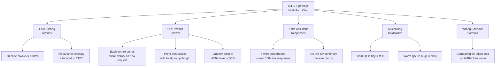

# Multi-Turn Chat: Root Cause Analysis

## Executive Summary

The Multi-Turn Chat experiment shows a **0.47x "speedup"** — meaning it's actually **2.1x SLOWER** on warm hits than cold misses. This is the **opposite** of what caching should achieve. The problem has **5 interconnected root causes**.

---

## Problem 1: Fake Timing Metrics (The Hidden Bug)

> [!CAUTION]
> The TTFT, Prefill, Decode, and TPOT numbers for Multi-Turn Chat are **entirely fabricated** by the fallback estimator — they are NOT real measurements.

### Evidence

Look at the CSV data for Multi-Turn Chat queries:

| Query | Latency (s) | TTFT (ms) | Decode Time (ms) | TPOT (ms) | Decode Throughput |
|-------|-------------|-----------|-------------------|-----------|-------------------|
| Q1    | 0.1607      | 60.75     | **100.0**         | **5.263** | **200.0**         |
| Q10   | 0.1647      | 64.65     | **100.0**         | **5.263** | **200.0**         |
| Q33   | 0.9889      | 888.86    | **100.0**         | **5.263** | **200.0**         |
| Q50   | 0.5558      | 455.81    | **100.0**         | **5.263** | **200.0**         |

Notice **every single query** has identical:
- `Decode Time = 100.0 ms` (always)
- `TPOT = 5.263 ms` (always)  
- `Decode Throughput = 200.0 tok/s` (always)

These are the **hardcoded fallback constants** from `run_single()`:

```python
# Line 354:
est_decode_rate = 200.0  # tok/s (conservative estimate)
est_decode_s = gtok / est_decode_rate  # = 20/200 = 0.1s = 100ms always
```

**What this means:** vLLM's `RequestMetrics` object is not returning `first_token_time` or `finished_time` for these queries, so the code falls back to a crude estimate that assumes decode is always 100ms and then attributes **all remaining latency to TTFT/prefill**.

Result: **All the latency variation you see is dumped into TTFT**, but you can't tell whether it's truly prefill-bound or decode-bound.

---

## Problem 2: Monotonically Growing Prompts → O(n²) Prefill Cost

> [!WARNING]
> The multi-turn prompt design causes prompts to grow linearly with each turn, while KV cache reuse only helps with the *prefix* portion — the new suffix must still be computed fresh every time.

### The Prompt Growth Pattern

The `build_multiturn_prompts()` function (line 1091) builds prompts like this:

```
Turn 1:  [Base_History] + [Q1] + [Fake_A1] + "Can you elaborate on: Q1"    → 65 tokens
Turn 10: [Base_History] + [Q1..Q10] + [Fake_A1..A10] + "elaborate on: Q10" → 304 tokens
Turn 32: [Base_History] + [Q1..Q32] + [Fake_A1..A32] + "elaborate on: Q32" → 915 tokens
Turn 50: [Base_History] + [Q1..Q50] + [Fake_A1..A50] + "elaborate on: Q50" → 1418 tokens
```

### What LMCache can reuse vs. what it can't

LMCache operates on **fixed-size token chunks** (CHUNK_SIZE = 256 tokens). For turn N:

- **Reusable prefix**: Chunks from the conversation history that were cached in turn N−1
- **New suffix**: The new `User: Q_N\nAssistant: Fake_A_N\nUser: elaborate on: Q_N` appended at the end
- **Partial chunk boundary issue**: If the new content starts mid-chunk, the entire chunk must be recomputed

The latency trace tells the real story:

| Turn Range | Avg Latency | Input Tokens | GPU KV Usage |
|------------|-------------|--------------|--------------|
| Q1–Q7      | ~0.16s      | 65–226       | 1.6%–5.5%    |
| Q8–Q31     | ~0.17s      | 256–884      | 6.2%–21.6%   |
| **Q32–Q35** | **0.66–0.99s** | 915–999   | 22.3%–24.4%  |
| Q36–Q50    | ~0.56s      | 1032–1418    | 25.2%–34.6%  |

At **Q32 the latency jumps 4x** (from ~0.19s to ~0.67–0.99s), but the cache shows the queries are still marked "Warm." This is because:

1. **Prompt is ~915 tokens → ~3.5 chunks cached**, but the new tail content always needs fresh computation
2. **The prefill cost scales with total prompt length**, not just the new portion, because vLLM still needs to process attention over all past tokens even if KV cache is reloaded
3. The model has crossed a performance cliff where the quadratic attention cost over ~900+ tokens starts dominating

---

## Problem 3: Fake Assistant Responses → Broken Cache Semantics

> [!IMPORTANT]
> The multi-turn history contains **fake, static assistant responses** that never match what the model would actually generate.

```python
# Line 1101:
history += f"Assistant: Here is my detailed answer for turn {i}.\n"
```

Every assistant response is literally `"Here is my detailed answer for turn 3."` — a short placeholder. This creates two problems:

### 3a. Unrealistically short history

Real multi-turn chats would have assistant responses of 50–200+ tokens each. The fake 8-word responses mean the history grows **much slower** than a real conversation. By turn 50, you only have ~1418 tokens instead of potentially 5000–10000+ tokens in a real chat.

**Impact**: The experiment is testing a **much weaker** version of the multi-turn problem than reality. Yet it's already performing poorly.

### 3b. No KV continuity with prior generations

In a real multi-turn system, the KV cache from generating turn N's response would be **kept in-place** for turn N+1. The engine would just append the new user message and continue decoding. But in this experiment:

1. Each prompt is sent as an entirely **new, independent request**
2. The engine discards internal KV state after each `llm.generate()` call
3. LMCache can only help by **reloading** cached prefix chunks from disk/CPU — not by keeping live GPU KV state

This means you're measuring **cache restore latency + re-attention cost**, not true KV cache reuse.

---

## Problem 4: Cold/Warm Detection is Misleading

The cold/warm state detection logic (line 427–438) classifies based on **disk cache delta**:

```python
if new_cache_files > 0:
    state = "Partial"   # some new KV written → partial miss
else:
    state = "Warm"      # no new cache entries → full hit
```

For Multi-Turn Chat, the data shows:

| State    | Count | Avg Latency |
|----------|-------|-------------|
| Cold     | 1     | 0.161s      |
| Partial  | 9     | 0.347s      |
| **Warm** | **40**| **0.346s**  |

The "Warm" queries have an avg latency of **0.346s** — which is **worse** than the Cold query (0.161s)! This is because:

- **Q1 (Cold, 65 tokens)**: Tiny prompt, fast regardless of caching
- **Q33 (Warm, 948 tokens)**: Huge prompt, labeled "warm" because no new disk cache file was written, but it's **6x slower** because the prompt is 15x larger

The cold/warm classification is **purely about cache write activity**, not about whether the query actually *benefited* from caching. "Warm" just means "part of the prefix was already cached," but the O(n) prefill cost over the full prompt length still dominates.

---

## Problem 5: Speedup Metric Is Fundamentally Broken for Multi-Turn

The speedup ratio formula is:

```
Speedup = Avg Cold Latency / Avg Warm Latency
```

For Multi-Turn Chat:
- **Cold avg**: 0.161s (only Q1, with 65 tokens)
- **Warm avg**: 0.346s (40 queries, with 92–1418 tokens)
- **Speedup = 0.161 / 0.346 = 0.47x**

This is mathematically inevitable:
- Cold = tiny prompt → fast
- Warm = huge prompts → slow
- Dividing small by large = always < 1

**The metric doesn't make sense for multi-turn** because cold vs warm isn't comparing the same workload. In Shared Prefix, cold and warm queries have the same prompt size (~163 tokens), so the latency difference genuinely measures cache benefit. In multi-turn, each query has a different-sized prompt.

---

## Root Cause Summary



---

## Solution Plan

### Fix 1: Get Real Timing Metrics
- Ensure vLLM's `RequestMetrics` actually populates `first_token_time` and `finished_time`
- This may require using the async engine or a different API endpoint
- If fallback is needed, compute actual decode rate from measured data, not hardcoded 200 tok/s

### Fix 2: Normalize the Speedup Metric for Multi-Turn
Instead of `Avg Cold / Avg Warm`, compare:
- **Per-turn marginal cost**: `latency_turn_N / new_tokens_in_turn_N`
- **Cross-turn amortized TTFT**: TTFT of the full history vs TTFT of just the new content
- **Prefix cache hit ratio**: `(reused_chunks / total_chunks)` per turn

### Fix 3: Use Real (or Realistic) Assistant Responses
Either:
- Actually generate responses with the LLM and feed them back (true multi-turn)
- Or simulate realistic-length responses (50–200 tokens) with synthetic text

### Fix 4: Implement Proper KV State Continuation
For genuine multi-turn, the engine should:
1. Keep the KV cache from turn N in GPU memory
2. Append only the new user message tokens for turn N+1
3. Continue from the existing KV state rather than reloading from disk

This is what vLLM's `chat()` API or session/context management does, rather than sending each turn as a fresh `generate()` call.

### Fix 5: Fix Cold/Warm Classification for Multi-Turn
Compare latency against a **token-count-normalized baseline**:
- Cold baseline: `expected_latency_for_token_count_without_cache`
- Measure actual savings: `baseline - actual_latency`
- This isolates cache benefit from prompt-length effects
