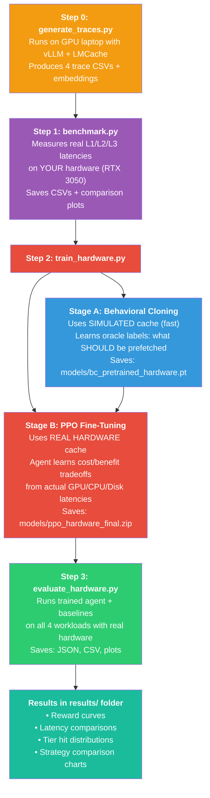

# Complete Project Flow: RL-Based KV Cache Prefetching

## The Real-World Problem

When you run a Large Language Model (like ChatGPT), every input prompt gets converted into **Key-Value (KV) cache** — a giant table of numbers the model uses to "remember" what it already processed. This KV cache is **huge** (~3 MB per 256 tokens for your Qwen2.5-0.5B model).

The problem: **GPU memory is limited** (your RTX 3050 has only 4 GB). When the KV cache doesn't fit in GPU, it spills to CPU RAM and then to disk. Accessing data from these slower locations adds latency — the user waits longer for the first token.

```
Speed comparison (accessing 3 MB of KV cache):

  GPU VRAM:    ~0.1 ms   ← instant, data is right there
  CPU RAM:     ~0.3 ms   ← need to copy over PCIe bus
  NVMe Disk:   ~6 ms     ← need to read from SSD
  Recompute:  ~37 ms     ← no cache at all, run the model again
                            (this is what happens on a cold start)
```

**Your project's solution:** Train a reinforcement learning agent to **predict** which KV cache chunks will be needed soon and **proactively move them** from disk → CPU before they're requested. This way, when the LLM asks for that data, it's already warm.

---

## How the 3-Tier Cache Works

```
┌────────────────────────────────────────────────────────────┐
│                    LLM receives query                      │
│                 "What is photosynthesis?"                   │
└──────────────────────────┬─────────────────────────────────┘
                           │
                           ▼
┌────────────────────────────────────────────────────────────┐
│  STEP 1: Model needs KV cache for this query's tokens      │
│  "Does chunk #7 exist anywhere in cache?"                   │
└──────────────────────────┬─────────────────────────────────┘
                           │
              ┌────────────┼────────────┐
              ▼            ▼            ▼
     ┌──────────────┐ ┌──────────┐ ┌──────────┐
     │  L1: GPU     │ │ L2: CPU  │ │ L3: Disk │
     │  Check here  │ │ Check    │ │ Check    │
     │  first       │ │ here     │ │ here     │
     │  (fastest)   │ │ (medium) │ │ (slow)   │
     └──────┬───────┘ └────┬─────┘ └────┬─────┘
            │              │             │
     Found? YES → done     YES → copy   YES → read
     Latency: 0.1ms        to GPU       from disk,
                            0.3ms        copy to GPU
                                         6ms

     Not found ANYWHERE? → MISS: recompute from scratch (37ms)
```

### The Waterfall (Eviction)

When a tier is full and a new chunk needs to go in, the **oldest chunk** (Least Recently Used) gets pushed down:

```
New chunk arrives → L1 (GPU) is full!
                    → Evict oldest L1 chunk → push to L2 (CPU)
                    → L2 is full!
                    → Evict oldest L2 chunk → push to L3 (Disk)
                    → L3 is full?
                    → Evict oldest L3 chunk → DELETE it forever
```

### The Prefetch (What the RL Agent Does)

```
BEFORE the RL agent:
  Query arrives → needs chunk #42 → found in L3 (disk) → 6ms latency 😞

WITH the RL agent:
  Agent predicts: "chunk #42 will be needed soon!"
  Agent action: PREFETCH chunk #42: disk → CPU RAM
  Query arrives → needs chunk #42 → found in L2 (CPU) → 0.3ms latency 😊
                                     (it was pre-moved!)
```

---

## The RL Training Loop (Step by Step)

Here's exactly what happens during one episode of training:

### Setup
```
Load trace CSV: 50 queries, each needing specific KV cache chunks
Load query embeddings: 384-dimensional vectors (from MiniLM model)
Create cache (start empty)
```

### Step 1 (Query #1 arrives)

```
1. OBSERVE: Agent sees:
   [query_embedding(384 dims)] + [cache_stats(3 dims)] + [candidate_scores(16 dims)]
   = 403-dimensional observation vector

   • query_embedding: "What does this query look like?"
   • cache_stats: [L1 is 0% full, L2 is 0% full, L3 is 0% full]
   • candidate_scores: [scores for 16 candidate chunks in L2/L3]
     (all zeros — cache is empty)

2. DECIDE: Agent outputs action = [0,0,0,0,0,0,0,0,0,0,0,0,0,0,0,0]
   (nothing to prefetch — cache is empty!)

3. EXECUTE: Process query #1 — needs chunks [0, 1, 2, 3, 4, 5, 6, 7]
   • All are MISS (cache was empty)
   • Create new tensors on GPU (or simulated: add to L1 dict)
   • Measured latency: ~37ms × 8 = ~296ms

4. REWARD: R = α×(0) - β×(0) - γ×(0) = 0
   (baseline was also all misses, so no time saved)

5. After step: L1 now has chunks [0,1,2,3,4,5,6,7]
```

### Step 2 (Query #2 arrives — a RAG query sharing chunks 0-6)

```
1. OBSERVE: Agent sees:
   • query_embedding: embedding of query #2
   • cache_stats: [L1 is 53% full, L2 is 0%, L3 is 0%]
   • candidate_scores: [scores for chunks in L2/L3]
     (nothing in L2/L3 yet, so all zeros)

2. DECIDE: Agent outputs action = [0,0,0,...,0]
   (still no candidates to prefetch)

3. EXECUTE: Query #2 needs chunks [0, 1, 2, 3, 4, 5, 6, 8]
   • Chunks 0-6: L1 HIT! Already on GPU → 0.1ms each
   • Chunk 8: MISS → create new on GPU → ~37ms
   • Total: 0.7 + 37 = 37.7ms

4. REWARD:
   • Baseline (without prefetch): same (no prefetch happened)
   • R ≈ 0 (no prefetch to reward/penalize)
```

### Step 15 (Later — cache is filling up, chunks spilling to L2/L3)

```
1. OBSERVE: Agent sees:
   • query_embedding: embedding of query #15
   • cache_stats: [L1: 100% full, L2: 80% full, L3: 20% full]
   • candidate_scores: [0.8, 0.3, 0.0, 0.7, ...] for 16 candidates
     NOW there are chunks in L2/L3 that could be prefetched!

2. DECIDE: Agent outputs action = [1, 0, 0, 1, 0, 0, 0, 0, 0, 0, 0, 0, 0, 0, 0, 0]
   "Prefetch candidate #0 and candidate #3!"

3. PREFETCH: Move those 2 chunks from L3 → L2
   • Real transfer: read from SSD, store in pinned CPU RAM
   • Cost: ~6ms each = ~12ms total
   
4. EXECUTE: Query #15 needs chunks [0, 1, 2, 3, 4, 5, 6, 22]
   • Chunk 0 was just prefetched to L2 → L2 HIT (0.3ms instead of 6ms!)
   • Chunks 1-6: L1 HIT (0.1ms each)
   • Chunk 22: MISS (37ms)
   • Total: 0.3 + 0.6 + 37 = 37.9ms

5. REWARD:
   • Baseline (without prefetch): chunk 0 would be L3 hit (6ms)
   • Time saved: 6ms - 0.3ms = 5.7ms
   • Migration cost: 2 chunks × 3MB = penalty
   • Candidate #3 wasn't needed → unused prefetch penalty
   • R = 1.0×5.7 - 0.01×6.0 - 0.1×1 = 5.54 ✅ Positive reward!
```

### Over 50,000 steps, the agent learns patterns like:
- "RAG queries always share the first 7 chunks → keep them warm"
- "Multi-turn chat grows by 1 chunk per turn → prefetch the next one"
- "Independent queries share nothing → don't bother prefetching"

---

## Complete File Flow

Here's every file and when it runs:



### File-by-File Map

```
rl_cache_prefetch/
│
├── data/                          ← INPUT DATA
│   ├── traces_rag.csv             ← 50 RAG queries (shared document)
│   ├── traces_prefix.csv          ← 50 prefix queries (shared system prompt)
│   ├── traces_nocontext.csv       ← 50 independent queries
│   ├── traces_multiturn.csv       ← 50 growing chat turns
│   ├── embeddings_*.npy           ← Pre-computed query vectors (384-dim)
│   ├── generate_traces.py         ← Creates the above (needs GPU + vLLM)
│   └── ttft_lookup.json           ← Measured TTFT values from experiments
│
├── configs/                       ← CONFIGURATION
│   ├── ppo_config.yaml            ← Config for SIMULATED training
│   └── hardware_config.yaml       ← Config for HARDWARE training ← NEW
│
├── env/                           ← ENVIRONMENT (what the RL agent interacts with)
│   ├── cache_simulator.py         ← SIMULATED cache (OrderedDicts + fake latencies)
│   ├── cache_env.py               ← Gymnasium env wrapping the simulator
│   ├── tier_config.py             ← Config for simulated tiers
│   ├── reward.py                  ← Reward function (shared by both!)
│   └── hardware/                  ← REAL HARDWARE CACHE ← ALL NEW
│       ├── hardware_config.py     ← Config with all knobs
│       ├── hardware_cache.py      ← Real GPU/CPU/Disk cache
│       ├── hardware_cache_env.py  ← Gymnasium env wrapping hardware
│       └── benchmark.py           ← Test + measure your hardware
│
├── agent/                         ← RL AGENT (shared by both paths)
│   ├── state_encoder.py           ← Converts query text → 384-dim embedding
│   └── policy.py                  ← MLP network (403 → 64 → 64 → 16)
│
├── train.py                       ← Train with SIMULATED cache (original)
├── train_hardware.py              ← Train with REAL HARDWARE cache ← NEW
│
├── eval/                          ← EVALUATION
│   ├── baselines.py               ← LRU/Oracle/NoCache (simulated)
│   ├── evaluate.py                ← Run all strategies (simulated)
│   ├── baselines_hardware.py      ← LRU/Oracle/NoCache (real hardware) ← NEW
│   ├── evaluate_hardware.py       ← Run all strategies (real hardware) ← NEW
│   ├── ablation.py                ← Reward function ablation study
│   └── plot_results.py            ← Plotting utilities
│
├── models/                        ← SAVED MODELS
│   ├── bc_pretrained.pt           ← Behavioral cloning weights (simulated)
│   ├── ppo_final.zip              ← PPO model (simulated)
│   ├── bc_pretrained_hardware.pt  ← Behavioral cloning weights (hardware) ← NEW
│   └── ppo_hardware_final.zip     ← PPO model (hardware) ← NEW
│
└── results/                       ← ALL OUTPUTS
    ├── metrics.json               ← Simulated evaluation results
    ├── hardware_metrics.json      ← Hardware evaluation results ← NEW
    ├── hardware_training_metrics.csv  ← Per-episode training data ← NEW
    └── plots/                     ← All generated charts
```

---

## What You Need to Do to Run This

### Prerequisites on the RTX 3050 Laptop

```bash
# 1. Python environment
python -m venv .venv
source .venv/bin/activate

# 2. Install PyTorch with CUDA (for your RTX 3050)
pip install torch torchvision --index-url https://download.pytorch.org/whl/cu121

# 3. Install project dependencies
pip install -r requirements.txt

# 4. Verify CUDA works
python -c "import torch; print(f'CUDA: {torch.cuda.is_available()}, GPU: {torch.cuda.get_device_name(0)}')"
# Expected: CUDA: True, GPU: NVIDIA GeForce RTX 3050 Laptop GPU
```

### Run Steps (in order)

```bash
# ─── STEP 0: Traces (already done) ───────────────────────────
# Your trace CSVs already exist in data/
# Skip this unless you want to regenerate them:
# python data/generate_traces.py  ← needs vLLM + LMCache on GPU

# ─── STEP 1: Benchmark your hardware ─────────────────────────
# This measures REAL L1/L2/L3 latencies on YOUR RTX 3050
# Takes ~2-5 minutes, produces CSVs and plots
python -m env.hardware.benchmark

# ─── STEP 2: Train ───────────────────────────────────────────
# Quick test first (< 2 min):
python train_hardware.py --quick

# Full training (~10-30 min depending on hardware):
python train_hardware.py

# With more cache pressure (recommended for better learning):
python train_hardware.py --l1-mb 24 --l2-mb 32

# ─── STEP 3: Evaluate ────────────────────────────────────────
python eval/evaluate_hardware.py
```

---

## Remaining Issues / TODOs

### 1. ⚠️ Trace Generation Problem (you mentioned this)

The `generate_traces.py` script requires vLLM + LMCache + a GPU — it runs the actual LLM and records what happens. You said there's a problem with this. **For now, this doesn't block training** — the existing trace CSVs in `data/` work fine with both simulated and hardware cache.

When you fix trace generation later, the traces feed into both paths identically.

### 2. ⚠️ Cold Miss Latency is "Simulated" in Hardware Mode

When a chunk is a MISS in `HardwareCache`, we create a random tensor on GPU. This measures the **tensor allocation time** (~0.05ms), NOT the actual LLM forward pass time (~37ms). The real cold compute would require running the LLM model, which we can't do during RL training (the LLM isn't loaded).

**Impact:** The reward signal for MISS events won't perfectly match real deployment. One fix would be to add an artificial `time.sleep()` for MISSes, but this would make training very slow. The current approach is standard in RL for cache optimization.

### 3. 📝 Potential Config Tuning Needed

After running the benchmark, you might want to adjust `configs/hardware_config.yaml`:
- If measured L3 latency ≠ 6ms, update `l3_hit_latency_ms`
- If measured L2 latency ≠ 0.24ms, update `l2_hit_latency_ms`
- These affect the **baseline** calculation which drives rewards

### 4. 📝 No Changes Required to Existing Code

Everything is additive. The original simulated path (`train.py`, `evaluate.py`) continues to work exactly as before. You can always run the simulated version alongside the hardware version and compare results.
